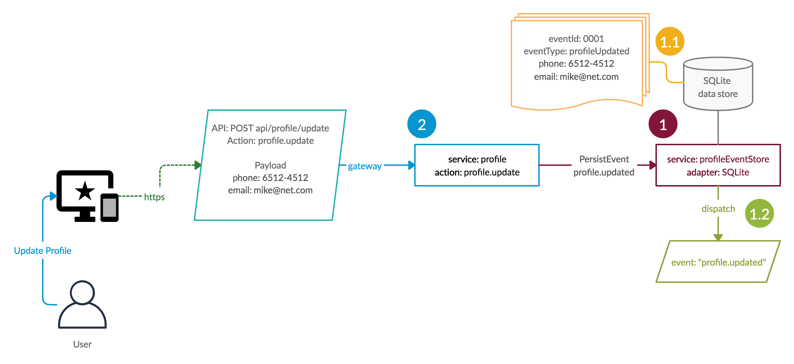
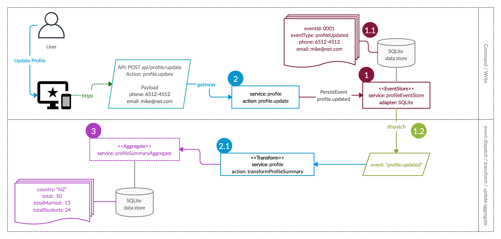

# CQRS Mixin - Moleculer-Go

Make you life easy when doing CQRS back-ends :)

If you need some info on what CQRS is please [click here :)](https://blog.knoldus.com/cqrs-and-event-sourcing/)

## Imports

At minimum you will need ...

```go
import (
	"github.com/moleculer-go/cqrs"
    "github.com/moleculer-go/store"
    // if you are using sqlite as the store mechanism
	"github.com/moleculer-go/store/sqlite"
)
```

## Event Store



1.  The first piece is the event store which is responsible to store the events (aka commands) and also propagate events to be processed and stored in aggregates.

        	1.1 - The event store uses an adaptor to store the data allowing you to choose between multiple data stores. In this example we use SQLite. Once the event is saved for later processing the event store returns a success response. This operation goal is to be fast and reliable.

        	1.2 - The event store will dispatch each event and any service that subscribes to the event "profile.updated" will be able to process is it.

2.  The second piece is the service that will expose the action to be triggered by an api call.

        	The action is responsible to perform validation and modification to the payload before saving the event. The action should not call any expensive service/action/lib at this stage since the objective is to save the event (aka write the command) as soon as possible. Complicated or expensive rules should be done later when the event is dispatched.

        	In this case the "profile.update" action maps directly to the event store using ```events.MapAction("update", "profile.updated")```.

3.  The third piece is the Aggregate which is where you will store your data. More details on that later.

```go
//1. event store
var events = cqrs.EventStore("profileEventStore", storeFactory())

//2. profile service with actions and CQRS transformations
var Service = moleculer.ServiceSchema{
	Name:   "profile",
	Mixins: []moleculer.Mixin{events.Mixin(), propertiesAggregate.Mixin(), summaryAggregate.Mixin()},
	Actions: []moleculer.Action{
		events.MapAction("update", "profile.updated"),
		//** Incomplete profile service **//
	}
}
```

## Aggregates

Aggregates are where you store your data in the way you want to consume it. Basically you will query your aggregates.

If you have a screen that need to display the user profile you need an aggregate for that.

If you want some statistics (total, totalMarried, totalStudents) by country you need an aggregate for that.



```go
//3. create an aggregate (simple table to store computed values)
var summaryAggregate = cqrs.Aggregate(
	"profileSummaryAggregate",
	storeFactory(map[string]interface{}{
		"country": "string",
		"total": "integer",
		"totalMarried": "integer",
		"totalStudents": "integer",
	}),
	cqrs.NoSnapshot,
).Snapshot("propertyEventStore")

//now complete profile service with transform action and event mapping
var Service = moleculer.ServiceSchema{
	Name:   "profile",
	Mixins: []moleculer.Mixin{events.Mixin(), propertiesAggregate.Mixin(), summaryAggregate.Mixin()},
	Actions: []moleculer.Action{
		//2. profile.update action just persists the payload in the store
		events.MapAction("update", "profile.updated"),
		{
			Name:    "transformProfileSummary",
			Handler: transformProfileSummary,
		},
	},
	Events: []moleculer.Event{
		//1.2 mapping the event "profile.updated" to update the summaryAggregate aggregate using the transformation "profile.transformProfileSummary".
		summaryAggregate.On("profile.updated").Update("profile.transformProfileSummary"),
	},
```

## Transformations

Between your event and your aggregates you need to transform the data.
In a traditional app where in the controller or business object you have assemble/transform all the data from the request to the format acceptable in your database.
This exactly the same thing you do here, but you start with the event and end with a aggregate record that will be wither: be created, update or removed.

The example bellow will create or update a summary record.

```go
//2.1 transforms the contents of the event "profile.created"
// into a profile summary update.
func transformProfileSummary(context moleculer.Context, event moleculer.Payload) interface{} {
	profile := event.Get("payload")
	summary := <-context.Call("profileSummaryAggregate.find", map[string]interface{}{
		"country": profile.Get("country").String(),
	})
	result := map[string]interface{}{}
	if summary.Len() > 0 {
		summary = summary.First()
		result["id"] = summary.Get("id").String()
	} else {
		summary = payload.New(map[string]interface{}{
			"country": profile.Get("countryCode").String(),
			"total": 0,
			"totalMarried": 0,
			"totalStudents": 0,
		})
	}
	result["total"] = summary.Get("total").Int() + 1
	if isMarried(profile) {
		result["totalMarried"] = summary.Get("totalMarried").Int() + 1
	}
	if isStudent(profile) {
		result["totalStudents"] = summary.Get("totalStudents").Int() + 1
	}
	result["country"] = summary.Get("country").String()
	return result
}

// ...
// using it

//updating a profile
profile := <-bkr.Call("profile.update", M{
			"name":        "John",
			"married":      true,
			"country": "NZ",
		})

// profileSummaryAggregate now contains a record for country code NZ and totalMarried = 1 and total = 1

// see more in the examples folder.

```

### Store Adaptor

```go
// ...
// storeFactory high order func that returns a cqrs.StoreFactory function :)
// and merges the fields passed to this function, with the fields received by the cqrs.StoreFactory func.
func storeFactory(fields ...map[string]interface{}) cqrs.StoreFactory {
	return func(name string, cqrsFields, settings map[string]interface{}) store.Adapter {
        fields = append(fields, cqrsFields)
        //creates an store adapter, in this case SQLite
        //the store adapter is use to store data of the eventStore, so here is where
        //you define the back end of your eventStore.
        // You could use mongo.MongoAdapter to have your eventStore backed by mongo DB.
		return &sqlite.Adapter{
			URI:     "file:memory:?mode=memory",
			Table:   name,
			Columns: cqrs.FieldsToSQLiteColumns(fields...),
		}
	}
}

```

### Storing Events

```go
// service property has an action create that will store the event "property.created" with the payload
// sent to the action.
var Service = moleculer.ServiceSchema{
	Name:   "property",
	Mixins: []moleculer.Mixin{events.Mixin(), propertiesAggregate.Mixin(), summaryAggregate.Mixin()},
	Actions: []moleculer.Action{
		// events.MapAction() creates a moleculer.Action with a handler that will respond to the action.
		// when the action property.create is invoked the eventStore will save the event an respond back with an standard answer.
		events.MapAction("create", "property.created"),
        //...

```

### Pumping and handling events

```go
//same service as above, now is to demonstrate how you handle events dispatched by the event pump.
var Service = moleculer.ServiceSchema{
	Name:   "property",
	Mixins: []moleculer.Mixin{events.Mixin(), propertiesAggregate.Mixin(), summaryAggregate.Mixin()},
	Actions: []moleculer.Action{
        //these are transformation actions that are invoked by the aggregate handlers.
       {
            Name:    "transformProperty",
            Handler: transformProperty,
        },
        {
			Name:    "transformCountrySummary",
			Handler: transformCountrySummary,
		},
    Events: []moleculer.Event{
            // the event pump will dispatch a "property.created" event for every "property.created" event stored.
            //It does it at different times, the save process only saves, then the event pump dispatch the events.
            propertiesAggregate.On("property.created").Create("property.transformProperty"),
            summaryAggregate.On("property.created").Update("property.transformCountrySummary"),
        },
        //...
```

## Aggregates

Aggregates are database tables, elastic search indexes and etc. Simple as that. They store the "calculated values" or the "current state of the system" :)
Basically there are never queries on events. Events are dispatched and any moleculer services listen to the them.
Aggregates have an api to map event -> transformation -> aggregate action

```go
 propertiesAggregate.On("property.created").Create("property.transformProperty"),
```

The code above is listening to event "property.created", it will use the transformation action "property.transformProperty" and it will invoke the aggregate action create.

```go
summaryAggregate.On("property.created").Update("property.transformCountrySummary"),
```

The code above is listening to event "property.created", it will use the transformation action "property.transformCountrySummary" and it will invoke the aggregate action Update.

### Define your Aggregates

Aggregate are tables of data and depending on the data store they need an schema.
In this case with SQLite we need to specify the fields in our aggregate.

```go
var summaryAggregate = cqrs.Aggregate(
"profileSummaryAggregate",
storeFactory(map[string]interface{}{
"countryCode": "string",
"total":       "integer",
"beachCity":   "integer",
"mountain":    "integer",
}),
cqrs.NoSnapshot,
).Snapshot("propertyEventStore")
```

An aggregate contain all the actions available to any store (https://github.com/moleculer-go/store)
So you can just do:

```go
summaries := <-bkr.Call("profileSummaryAggregate.find", M{})
```

## Snapshots

Snapshots are a work in progress. basic feature is implemented and now under stress test.

snapshotName := aggregate.snapshot():

- aggregate stops listening to events -> pause aggregate changes :)
- create a snapshot event -> new events will continue to be recorded in the events store after this point! = Write is enabled.
- ** no changes are happening on aggregates ** but reads continue happily.
- backup aggregates -> aggregate.backup(snapshotName) (SQLLite -> basicaly copy files :) )
- process all events since the snapshot and start listening to events again.
- done.
- Error scenarios:
- if backup fails the event is marked as failed and is ignored when trying to restore events.
- Rationale:
  ---> Since you created an event about the start of the snapshot at the same moment you stop processing events for that aggregate. this event should point to the backup file. so it can be used when restoring the snapshot.

The restore an snapshot is also very simple
aggregate.restore(snapshotName)

- find backup files using snapshotName and locate snapshot event in the event store.
- ** at this stage the event store might be receiving new events -> write is enabled **
- backup is restored.
- read is enabled :)
- events start processing from the snapshot moment
- ** system takes a while to catch up **
- system is eventually consistent :)

## References

Diagram Source: https://app.creately.com/diagram/1hz4OEfdfxM/edit
